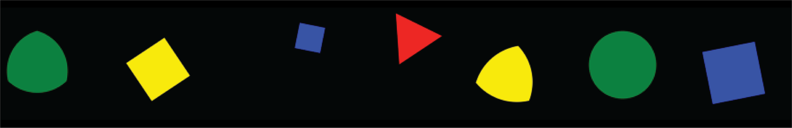

# NA_DA: Not-A-DAtabase generator of probabilistic synthetic data 

<p align="center">
 
</p>

NA_DA is an open-source software written in Python that generates datasets of regular two-dimensional geometric shapes based on probabilistic distributions.

NA_DA comes with an intuitive GUI (Graphical User Interface) that allows users to define shapes, colors, and distributions of features of datasets consisting of image sets and CSV files containing metadata for each element. These databases can be saved to provide a unique identifier of the dataset, allowing perfect reproducibility or easy modification of the dataset using the GUI or directly by calling the generator class. Therefore, NA_DA is a tool to help and support the investigation of trustworthiness, overconfidence, uncertainty, and computation time of machine learning and deep learning models.
 
If you use this dataset in your work, please cite it as follows:

## Bibtex

```
@article{volpinidatabase,
  title={NA DAtabase: Generator of Probabilistic Synthetic Geometrical Shape Dataset},
  author={Volpini, Federico and Caudai, Claudia and Del Corso, Giulio and Colantonio, Sara}
}
```

NA_DA can generate datasets of 2D shapes with customizable dataset attributes, latent variables, uncertainty, deformation and their multivariate distributions.

## User defined parameters:

### Dataset Attributes:
The generator can be used to define different databasets according to user-defined parameters. In particular
* **Dataset size:** the maximum number of generated images.
* **Sampling strategy:** define the technique for sampling a probability distribution (Monte Carlo, Latin HyperCube Sampling, or Low Discrepancy Sequence).
* **Random seed:** the number used to initialize the random generator.
* **Resolution:** the resolution in pixels of the image's sides.
* **Background color:** The color in the hexadecimal value of the image's background.
* **Allow out-of-border:** if you select this option, shapes can extend beyond the image borders.

### Latent factor values:

* **Color:** all colors can be chosen. Colors can be selected using the color wheel or by entering the hex code directly.
* **Shape:** 2D regular shapes. Shapes are identified by the number of vertices (i.e, 0:circle, 3:triangle, 4:square, and so on)
* **Radius:** length of the radius, identified by a percentage on the length of the X of Y axes (output images are square).
* **Rotation:** Rotation in degrees (from 0 to 360).
* **Center X:** position of the center on the X axes, identified by a percentage on the length of the X axes. 
* **Center Y:** position of the center on the Y axes, identified by a percentage on the length of the Y axes. 

<p align="center">
  
</p>

### Uncertainty Related Latent Variables:

Every image can be associated to a level of uncertainty.
* **Classification noise (labeling noise):** quantifies the uncertainty in predicting a class for a given instance.
* **Deformation:** continuous deformation from original shape to circle.
* **Blur:** Applies a Gaussian blur to the entire surface, with a blur radius determined by the power argument (default value: 2).
* **White Noise:** Applies a weighted Gaussian noise to the entire surface (noise power between 0 and 1). 
* **Holes:** Creates holes on the main canvas (default number of holes: 2) 
* **Additive Noise:** affects the regression values.
* **Multiplicative Noise:** affects the regression values.

<p align="center">
  
</p>

In particular, the deformation parameter acts on the image to change it from the original shape (i.e. an arbitrary regular polygon) to the circle.  This is directly related to the ability of the model to correctly identify deformed shapes as unreliable predictions.

### Multivariate distribution:

Each of the latent variables and the uncertainty measures can be described by one of the following distributions
* *Constant* (fix the value of a latent variable to simplify the problem)
* *Uniform distribution* (equivalent to generating all possibilities)
* *Gaussian distribution*
* *Truncated Gaussian*

In addition, each of the above distributions is associated with a correlation matrix, which makes it possible to generate a corresponding multivariate distribution according to Sklar's theorem.  Thus, the latent variables can be generated to be dependent on each other.

## Examples of use:

### Disentanglement metrics:

This dataset was created as a unit test of disentanglement properties of unsupervised models under different probability distributions of the latent variables. NA_DA can be used to determine how well models recover the ground truth latent presented above, especially when their distributions are altered compared to the standard uniform ones proposed in most synthetic datasets.

### Uncertainty Quantification and Reliability:

This database generator is suitable for uncertainty quantification and reliability analysis on synthetic images (i.e., to test models developed using Bayesian formalism). In particular, different levels of uncertainty (both Epistemic and Aleatoric) can be imposed on the dataset to assess the ability of the model to produce correct reliability estimates.

A detailed description of type of uncertainties and probabilistic models can be found in:

*“Shedding light on Uncertainties in Machine Learning: formal derivation and optimal model selection”*, Del Corso, S. Colantonio, G. Caudai, C. et. al. 


